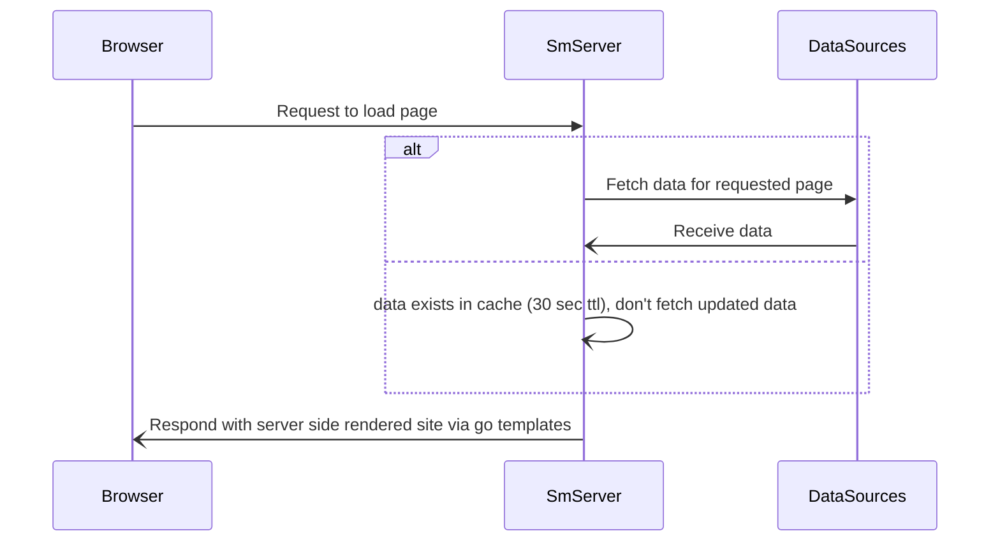

# Scuffed Metar
scuffed-metar is a server/site that pulls weather information for northern saskatchewan airports creating a unified view of weather conditions and offers significant ux improvements over the counterpart site(s).

## How it works

For the [METAR page](http://scuffed-metar.com/) data has to be pulled from several servers so the requests are done concurrently to avoid i/o blocking. I could update the data proactively; reducing page load time
but doing it on demand when the page is requested minimizes the load on 3rd party servers (feels like bad manners to spam requests if the data isn't needed).

Other pages are a single request so their load times are much quicker.

## What the People Are Saying
- "[they] can make a better weather app in their parents basement than [the] CFPS weather website"
- "scuffed metar  is so ideal for our operation"
- "sh*t looks clean af on mobile"
